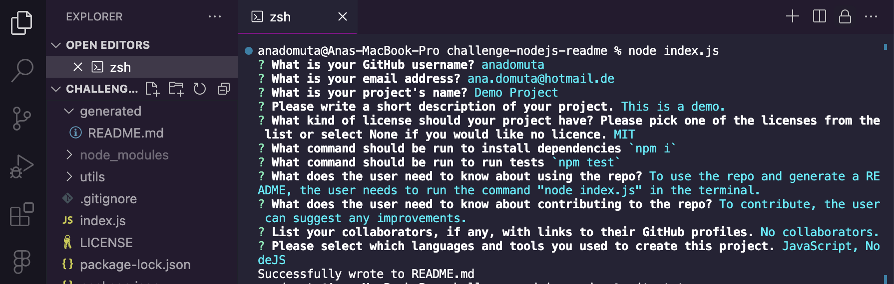
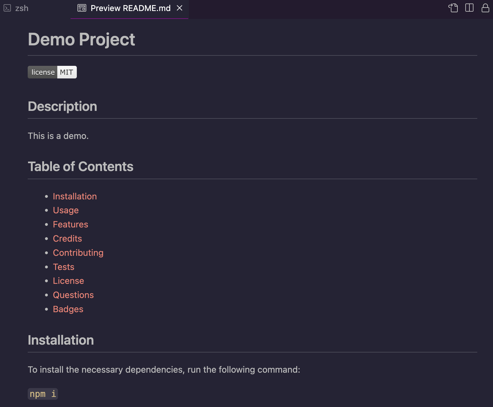
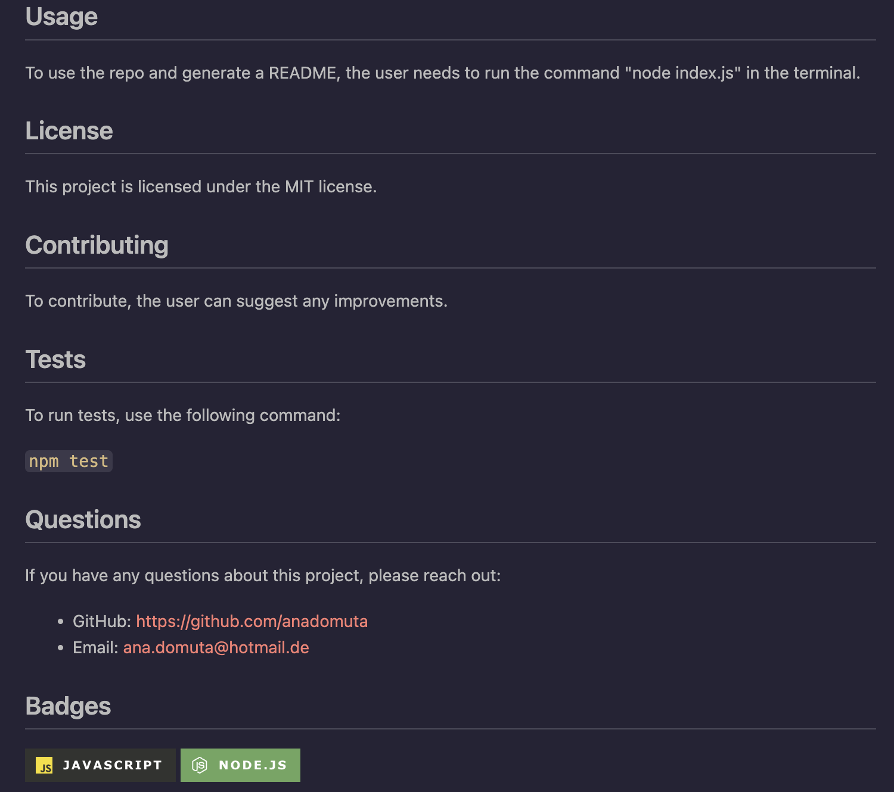

# README Generator

A command-line application designed to dynamically generate a professional README.md file based on user input.

## Description

The project represents an application that allows users to generate a README file.

The application offers the following functionalities:

When a user is prompted for information about the application repository, a high-quality, professional README.md is generated with:

- The project title.
- Sections:
  - **Description**: User input.
  - **Table of Contents**: Links to corresponding sections of the README.
  - **Installation**: Default input or an option for the user to add instructions.
  - **Usage**: Option for the user to add details.
  - **License**: Options for the user to select between licenses. When a user chooses a license for their application from a list of options, a badge for that license is added near the top of the README, and a notice is added to the section entitled License explaining which license the application is covered under.
  - **Contributing**: User input.
  - **Tests**: Default input or an option for the user to add instructions.
  - **Credits**: User input for resources used.
  - **Badges**: The user can select different badges for their project based on the languages used to develop it.
  - **Questions**: When a user enters their GitHub username and email address, it's added to this section with a link to their GitHub profile.

## Usage

To generate a README, open your terminal, run the command `node index.js` and answer the prompts.

The following walkthrough video demonstrates the functionality of the README generator: https://drive.google.com/file/d/1TFYg_bjtpVwnMArKppWv8gfbAJgaWikK/view?usp=sharing

The screenshots below display an overview of a sample generated README.

## Credits

The project was built following the instructions from the materials in the Skills Bootcamp in Front-End Web Development by edX.

In addition, the following resources were used:

1. Bootcamp content
2. Tutoring session: use of sync
3. Markdown badges from [ileriayo](https://github.com/Ileriayo/markdown-badges?tab=readme-ov-file#markdown-badges)

## License

This project is licensed under the terms of the MIT license.

## Badges

